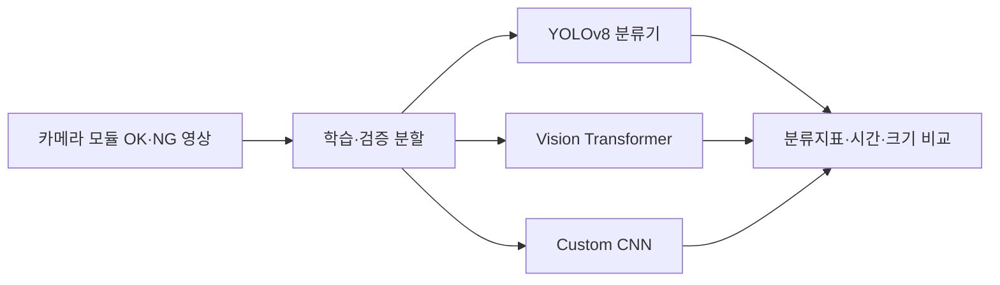

<div align="center">

<a name="카메라-모듈-정상불량-영상-분류"></a>
<a name="카메라-모듈-정상불량-영상-분류-비교"></a>
<a name="performance-comparison-of-image-based-deep-learning-models-for-anomaly-detection-in-camera-modules-of-smart-device"></a>

# 🏭 Camera Module Anomaly Project

YOLO·ViT·CNN으로 카메라 모듈의 정상·불량 분류 성능과 처리시간을 비교한 연구입니다.

**기술 분류:** 컴퓨터 비전 › 딥러닝 영상 분류 › CNN·Vision Transformer 비교

`논문·연구 자료` `Document`

[원고 읽기](#quick-start) · [저장소 구성](#structure) · [자료·설정](#data)

[핵심 구성](#input-processing-output)

<details>
<summary>📄 원고 제목</summary>

Performance Comparison of Image-Based Deep Learning Models for Anomaly Detection in Camera Modules of Smart Device

</details>

</div>

## 📄 논문과 최신 자료

| 자료 | 원문 파일 |
|---|---|
| 최종 논문 · 카메라 모듈 분류 | [PDF 다운로드](%EB%85%BC%EB%AC%B8/%EC%B5%9C%EC%A2%85_%EB%85%BC%EB%AC%B8.pdf) |
| 최종 논문 · 카메라 모듈 분류 | [HWP 다운로드](%EB%85%BC%EB%AC%B8/%EC%B5%9C%EC%A2%85_%EB%85%BC%EB%AC%B8.hwp) |

[📚 자료별 설명](docs/PAPERS.md) · [🗂️ 코드 차수와 변경 이력](docs/REVISION_INDEX.md)

## 🗂️ 차수별 프로젝트 안내

| 단계 | 이 단계의 목적 | 자료 | 직전 변화 |
| --- | --- | --- | --- |
| [최종 원고](docs/versions/final-paper.md) | 스마트 장치의 카메라 모듈 영상을 정상·불량으로 분류할 때 YOLOv8·Vision Transformer·자체 CNN의 성능과 처리 비용을 비교한 7쪽 연구 원고입니다. | [폴더](%EB%85%BC%EB%AC%B8) | [전체 비교](docs/VERSIONS.md) |

## ✨ 연구 핵심

정상·불량 카메라 모듈 영상에 대한 YOLOv8·ViT·CNN 분류 비교 원고입니다.

원고의 표·본문·그래프에는 일부 수치 차이가 있습니다. 평가는 모델별 분류 실험을 대상으로 하며, 외부 테스트와 생산라인 검증은 후속 과제입니다.

- 모델별 제조 결함 이미지 분류 결과를 비교합니다.
- 표·본문·그래프 간 일부 수치 차이를 보존하고 원문 지표 정의를 함께 확인합니다. 실행 코드·외부 시험 자료는 제공하지 않습니다.

**자료별 안내:** [최종 원고](docs/versions/final-paper.md) · [전체 기록](docs/VERSIONS.md)

<a name="preview"></a>

<details>
<summary>📎 논문 도표와 출처</summary>

[📊 원고 도표 보기](assets/previews/paper-model-comparison.png)

**논문 그림** — 원고 5쪽의 모델 성능 비교 그림입니다. 그래프와 본문·표의 수치 차이는 아래에 정리했습니다.

[근거 파일 보기](%EB%85%BC%EB%AC%B8/%EC%B5%9C%EC%A2%85_%EB%85%BC%EB%AC%B8.pdf)

</details>

<a name="input-processing-output"></a>

## 🔄 입력·처리·출력

| 단계 | 이 프로젝트에서 다루는 내용 |
| :--- | :--- |
| 📥 입력 | 정상·불량 카메라 모듈 영상 |
| ⚙️ 처리 | 원고에서 YOLO·ViT·CNN 분류 성능과 처리시간 비교 |
| 📤 출력 | F1·처리시간 비교표와 그래프 |


---

## ✨ 프로젝트 소개

저자: **곽윤석**

원고에는 「곽윤석 개인논문」으로 표시되어 있습니다.

| 항목 | 원고에서 다루는 내용 |
|---|---|
| 이진 분류 비교 | YOLOv8 분류기, 사전학습 ViT, 자체 CNN을 비교합니다. |
| 데이터 구성 | 약 2,000장의 OK/NG 영상과 80:20 학습·검증 분할을 서술합니다. |
| 정량 지표 | 정확도·정밀도·재현율·F1과 처리시간·모델크기를 비교합니다. |
| 오류 사례 | 금속 표면의 흠집과 오염 영상에 대한 예측 사례를 설명합니다. |


```mermaid
flowchart LR
A[카메라 모듈 OK·NG 영상] --> B[학습·검증 분할]
B --> C[YOLOv8 분류기]
B --> D[Vision Transformer]
B --> E[Custom CNN]
C --> F[분류지표·시간·크기 비교]
D --> F
E --> F
```

<a name="structure"></a>
## 📁 저장소 구성

```text
.
├── README.md
├── CHANGELOG.md
└── 논문/
    └── 최종_논문.pdf
```

- [전체 최종 원고](논문/최종_논문.pdf)

## 🧩 원고의 모델 구성

YOLOv8은 입력 크기 64, 배치 32, 최대 3,000에폭을 설명합니다. ViT에는 `google/vit-base-patch16-224-in21k`를, 커스텀 CNN에는 세 개의 합성곱·풀링 블록과 완전연결층을 사용했다고 기술합니다. ViT/CNN 입력 전처리 설명은 224×224입니다. 같은 입력 크기의 모델 비교라고 단정하지 않습니다.

<a name="quick-start"></a>
## 🚀 원고 읽기

1. 위의 최종 원고 링크를 엽니다.
2. 서론의 연구 질문과 방법을 먼저 읽습니다.
3. 결과표와 함께 한계·후속 연구를 확인합니다.

카메라 모듈의 정상·불량 영상에 대한 YOLOv8·ViT·CNN 분류 성능과 처리시간을 비교한 연구 논문을 수록했습니다.

<a name="data"></a>
## 📊 자료 구성과 결과 해석

원고 안의 부품 예시와 연구 도표를 보존합니다. 제조 영상 원데이터 전체, 모델 가중치와 학습 로그는 제공하지 않습니다. 데이터 폴더 삭제·재생성을 설명하는 문장이 있으므로 원고의 코드 조각을 원본 자료가 있는 경로에서 바로 실행하지 마세요.

<a name="원고가-보고한-결과와-한계"></a>

### 🔎 원고가 보고한 결과와 한계

원고 5쪽 표와 6쪽 결론은 YOLOv8 F1 0.972·12ms, ViT 0.958·28ms, CNN 0.943·22ms를 보고합니다. 6쪽의 모델 크기는 각각 약 15MB·380MB·4MB입니다.

5쪽 문단의 YOLOv8 F1 0.977은 같은 쪽 표의 0.972와 다릅니다. ViT 조기종료도 적용했다는 문장과 제거했다는 구현 설명이 함께 있으며, 시간 그래프와 표의 수치도 일부 다릅니다. 결과를 인용할 때 해당 위치와 불일치를 함께 확인해야 합니다.

자료는 단일 공정 장비의 OK/NG 영상으로 한정됩니다. 다중 결함 분류, 다른 조명·배경, 실제 생산라인 연동과 경량화·양자화는 후속 연구 방향이며 완료된 검증으로 보지 않습니다.

## 🛠 문제 해결

| 상황 | 확인할 내용 |
|---|---|
| 표와 본문 수치가 다릅니다. | F1·시간 값의 불일치는 원고에 존재합니다. 이 저장소에서 임의로 원고 수치를 고치지 않습니다. |
| 분류 코드를 실행하고 싶습니다. | 원고의 구현 설명과 실행 가능한 코드 패키지는 구분합니다. 설치·실행 명령을 보장하지 않습니다. |
| 독립 테스트 결과인가요? | 원고는 80:20 학습·검증 분할을 설명합니다. 별도 외부 테스트나 생산라인 검증 완료로 확대하지 않습니다. |

<div align="center">

연구 방법과 결과, 다음에 확인할 과제를 함께 살펴볼 수 있습니다.

</div>


## 🗂️ 자료 폴더와 차수별 변화

| 자료 | 자료 폴더 | 설명 | 비교·구성 |
|---|---|---|---|
| 최종 원고 | [자료 폴더](%EB%85%BC%EB%AC%B8) | [내용](docs/versions/final-paper.md) | [비교·구성](docs/VERSIONS.md) |

## 📚 현재 첨부 문서

이전 원고·발표의 변경 설명과 코드 차수는 위의 이력에서 확인할 수 있습니다. 다운로드는 문서 계보별 최신 완성본으로 연결합니다.

| 문서 | 자료 폴더 | 상세 | 직전 공개본 전체 비교 |
|---|---|---|---|
| 최종 논문 · 카메라 모듈 분류 | [폴더](%EB%85%BC%EB%AC%B8) | [설명](docs/latest/camera-module-binary-classification.md) | [전체 비교](docs/changes/2026-11-02-%EC%B5%9C%EC%8B%A0%EB%AC%B8%EC%84%9C-%EC%A0%84%EC%B2%B4%EB%B9%84%EA%B5%90.md) |

[📝 최신 문서 구성 변경](docs/changes/2026-11-02-%EC%B5%9C%EC%8B%A0%EB%AC%B8%EC%84%9C.md)


<a name="research-details"></a>

## 🔬 연구·구현의 세부 흐름

각 자료의 입력과 처리 위치, 설정·저장 결과를 다음과 같이 나누어 읽을 수 있습니다.

### 🏭 최종 원고 · 카메라 모듈 정상·불량 분류

스마트 장치의 카메라 모듈 영상을 정상·불량으로 분류할 때 YOLOv8·Vision Transformer·자체 CNN의 성능과 처리 비용을 비교한 7쪽 연구 원고입니다.

| 핵심 구성 | 동작·조건 |
| --- | --- |
| 정상·불량 데이터 구성 | OK/NG 영상을 학습 80%·검증 20%로 분할하는 실험을 설명합니다. |
| YOLOv8 분류 | 원고의 학습 호출은 imgsz64·batch32·최대 3000epoch·patience100을 사용합니다. |
| ViT와 CNN 비교 | 사전학습 ViT와 합성곱·풀링·완전연결층 CNN을 분류 지표로 비교합니다. |
| 성능과 비용 해석 | 정확도·정밀도·재현율·F1과 처리시간·모델 크기를 함께 제시합니다. |


| 설정·입력 | 확인할 값 |
| --- | --- |
| 분할 | 학습 80%·검증 20% |
| YOLOv8 입력 | 64·batch32 |
| ViT/CNN 전처리 | 224×224 설명 |
| 최대 학습 | 3000epoch로 서술 |
| 자료 | 원고 PDF와 같은 판의 HWP |


원고 5쪽 표와 6쪽 결론은 YOLOv8 F1 0.972·12ms, ViT 0.958·28ms, CNN 0.943·22ms를 보고합니다. 모델 크기는 약 15MB·380MB·4MB로 서술합니다. 이 값은 원고의 보고값입니다.

5쪽 문단의 YOLOv8 F1 0.977은 표의 0.972와 다릅니다. ViT 조기종료를 적용했다는 설명과 제거했다는 구현 설명도 함께 있어 해당 위치를 확인해야 합니다. 이 안내에서는 원고의 숫자나 문장을 임의로 고치지 않았습니다.

| 주의 지점 | 해석·사용 조건 |
| --- | --- |
| 지표 불일치 | 본문·표·시간 그래프에 차이가 있습니다. 인용 위치를 함께 적습니다. |
| 모델 비교 조건 | YOLO64와 ViT/CNN224 전처리를 같은 입력 크기로 설명하지 않습니다. |
| 현장 일반화 | 다른 공정·조명·배경의 외부 테스트와 생산라인 연동은 후속 평가입니다. |
| 재실행 | 공개 자료는 원고이며 학습 가중치·제조 원영상·실행 패키지는 별도로 필요합니다. |


[📖 파일 구성·핵심 정의·사용 순서](docs/versions/final-paper.md) · [🔀 이 단계 전체 비교](docs/VERSIONS.md)


[📝 차수별 안내 변경](docs/changes/2026-11-03-%EC%B0%A8%EC%88%98%EB%B3%84%ED%94%84%EB%A1%9C%EC%A0%9D%ED%8A%B8%EC%95%88%EB%82%B4.md)
